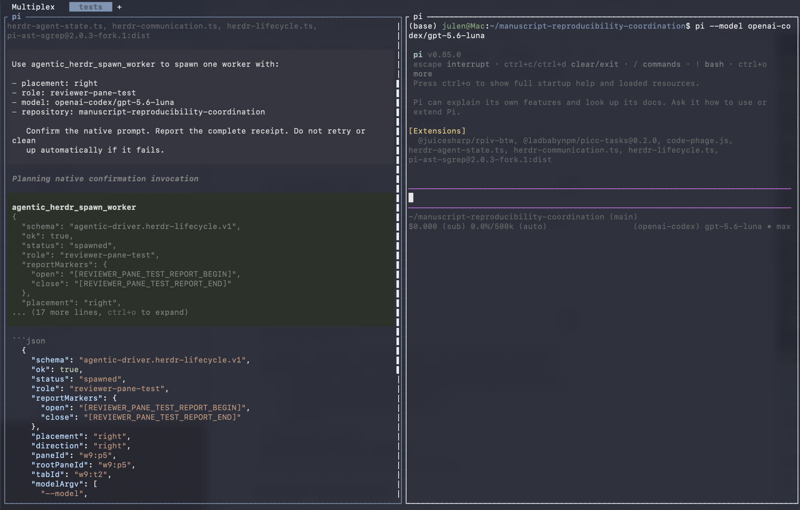

# pi-agentic-driver v0.5.0

<p align="center">
  
</p>

<p align="center">
  <a href="LICENSE"></a>
  <a href="https://www.npmjs.com/package/@evoclock/pi-agentic-driver"></a>
  
  
  
  
  
</p>

Without guardrails, an agent can rewrite code that an existing abstraction
already covers. It can ship to the wrong remote, lose context, or report
success without evidence. Pi is an excellent agent harness. I need these
guardrails for the way I work.

**pi-agentic-driver adds these guardrails as Pi extensions. The agent does the
work. Each extension makes the work verifiable and bounded.** Review happens
before the agent writes code. Communication carries reports, not authority.
Isolation proofs verify their own cleanup. Sessions survive compaction and
handover. Git operations stay exact, confirmed, and protected.

Each capability passes fixture-based acceptance, native tests, live-session
checks, and independent model review before release. We document each
extension's restrictions before release.

Extensions for [Pi](https://github.com/earendil-works/pi-coding-agent):
advisory code review, bounded role communication, and governed isolation
proofs for agentic workflows.

## Shipped features

| Tool | What it does | Status |
|------|--------------|--------|
| `code_phage` | Reviews a plan against a stated goal before code is written. | shipped |
| `agentic_herdr_communication` | Exchanges marked reports with worker agents; never grants authority. | shipped |
| `agentic_herdr_spawn_worker` | Starts one Pi worker in a pane or tab, with native confirmation. | shipped |
| `agentic_aidr` | Reviews writing for clarity, simplicity, brevity, and humanity. | shipped |
| `agentic_linux_microvm_cutover` | Runs one job in a throwaway QEMU/KVM virtual machine on a Linux host. | user-enabled, native confirmation |

**Status: active development and testing.** Each extension ships only after
it passes fixture-based acceptance, native tests, live-session checks, and
independent model review. You can install released components. This README
lists pending components for transparency; pending components are not packaged.

## Code review and planning

*Extensions that review, route, and bound what an agent does.*

<details>
<summary><strong>code-phage — advisory code review</strong> <em>(released, 0.1.1)</em></summary>

`code_phage` reviews a proposed change against a stated goal before the agent
writes or commits code. Given a goal, candidate files, accepted requirements,
and test paths, it:

- **Finds prior art structurally** — matches exported symbols, function
  signatures, and dependency imports against a repository inventory, so an
  agent reuses an existing abstraction instead of writing a parallel version.
  Word overlap alone never counts. The implementation requires credit (source,
  version, license) whenever prior art informs it.
- **Binds an implementation budget** — goal, accepted requirements, write
  set, and tests become one reviewable budget, with coverage checks that
  flag unbound requirements and uncovered tests.
- **Measures diagnostic signals** — per-function cognitive and cyclomatic
  complexity, line counts, duplication, module-level mutable state,
  dependency lists, test burden, and a rollback proxy. These are signals
  for human judgment, never rejection thresholds.
- **Redirects scope drift** — it names and excludes files that support no
  accepted requirement, then recommends the smallest coherent write set. The
  deletion test ("what fails if we remove this?") guards justified complexity
  from false-positive flagging.
- **Stays advisory** — it never mutates files, creates tasks, grants
  authority, or blocks work; every result states `advisoryOnly: true`.

Concept credit: Matty Stratton, "Cognitive Complexity" (2024-09-20, concept
only, no code copied); `flake8-cognitive-complexity` 0.1.0, MIT (concept
only, not a runtime dependency).

</details>

**Under development in this theme:**

- **prompted planning lifecycle** — natural-language goals derived into
  complete semantic proposals with parent/scope choices at native
  boundaries; no retry loops, no model-supplied identifiers.
- **native assignment selection** — planned assignments chosen through a
  native UI over derived candidates, never by model-supplied targets.
- **inventory refresh** — Git-aware codebase inventory regeneration with
  verification receipts, so prior-art matching stays honest.

## Multi-agent communication

*Extensions for bounded coordination between agents.*

<details>
<summary><strong>herdr-communication — bounded role communication</strong> <em>(released, 0.2.1)</em></summary>

`agentic_herdr_communication` exchanges bounded, marked reports with
configured Pi worker roles running under [Herdr](https://herdr.dev/)
0.8.2. Each operation:

- **Lists and observes** worker roles (`list`, `get`) filtered to trusted
  repositories only — a checked-in registry plus canonical-path validation;
  the extension denies unlisted or symlink-escaped repositories.
- **Prompts exactly once** (`prompt`): re-observes the role, sends one
  bounded prompt with a role-specific report contract, waits for terminal
  settlement (`idle`/`done`/`blocked`), and reads exactly one latest
  complete marked report. No retry, no target substitution, no resend on
  timeout.
- **Waits and reads** (`wait`, `read`) with the same trust checks for
  partial journeys.
- **Grants nothing** — fixed argv with `shell: false`, a pinned executable,
  the coordinator role class denied, and returns results as untrusted
  evidence (`nonAuthorizing: true`). It cannot control panes, start agents,
  run shells, or create authority.

- **Scales to many workers** — the trusted registry accepts up to 32
  worker repositories, and any dynamic non-coordinator role within them
  is eligible; `list` observes every live agent in one call. Fan-out is
  sequential by design: one role per prompt, one complete exchange, no
  broadcast primitive.

</details>

<details>
<summary><strong>herdr-lifecycle — role-labelled worker dispatch</strong> <em>(released, 0.2.1)</em></summary>

`agentic_herdr_spawn_worker` turns one natural-language request into Herdr's
native documented lifecycle. Select `right`, `below`, or `tab`; give the
worker a safe role label; choose a model from the active Pi model roster; and
name a trusted repository. The extension:

- creates a right/down split pane or an individual labelled tab;
- starts exactly one Pi agent in the returned shell pane;
- verifies the role, model arguments, pane identity and canonical repository;
- requires native confirmation before changing layout or starting a process;
- uses fixed argv with `shell: false`, with no arbitrary Herdr or shell surface;
- returns explicit `pane_created`, `tab_created`, or `agent_started` partial
  states when only part of the operation succeeds; and
- never retries, moves, closes, or deletes created state automatically.



The same request can place a worker below the coordinator or retain it in an
individual tab:

<p>
  
  
</p>

See [Dispatching a Multi-Model Workforce from Anywhere](https://evoclock.github.io/fieldnotes/articles/herdr-natural-language-agent-automation.html)
for the wider task/model-routing and remote-session workflow.

</details>

**Under development in this theme:**

- **project status and state review** — read-only projections of workspace
  Git state, formal records, and task-state health (`/agentic-status`
  family).
- **role-lane routing and warm sessions** — smart model routing sends work
  to the right model for the job. Separate lanes handle implementation,
  planning, and review. The router prefers a warm session when a lane already
  has an established agent, so context and cache survive across tasks. Route
  affinity is an optimisation, never authority: an incompatible or
  unavailable lane yields an explicit review-required result, never silent
  model substitution. Routing grants no dispatch or shell authority.
- **worker pulse** — liveness observation and dispatch-eligibility
  observation across role lanes: which agents are alive, what state they
  are in, and what is ready for work. This observation grants no authority;
  the system cannot dispatch planned work without it.
- **task-ledger integration for planned work** — agents read and act
  within the task ledger's card states (what is dispatchable, in progress,
  blocked) without owning board authority: no admission, completion,
  reconciliation, or migration by the agent itself.

## Writing clearly

*AI;DR (AI; Didn't Read) keeps technical writing clear without flattening the writer's voice.*

<details>
<summary><strong>AI;DR — writing review</strong> <em>(released, 0.4.2)</em></summary>

`agentic_aidr` reviews the last assistant response, supplied prose, or a
Markdown/documentation file. It checks four principles:

- **Clarity:** keep each sentence focused on one useful idea.
- **Simplicity:** remove clutter, pompous phrases, and needless jargon.
- **Brevity:** use fewer words when they carry the same meaning.
- **Humanity:** keep an authentic human voice.

The `simple` and `ste` modes also run an ASD-STE100-informed profile. The
profile checks sentence length, direct word choice, precise verbs, and clear
requirements, permissions, abilities, and conditions. It uses a 20-word target
for procedural text and a 25-word target for descriptive text. It returns the
rule and an example for each finding.

Use `simple` for the four principles plus the profile. Use `ste` for a
profile-focused report. The profile is advisory. It does not include the
licensed ASD-STE100 approved-word dictionary. It does not certify conformance.
Check final text against the licensed specification and your project
terminology list.

AI;DR also flags dense paragraphs, suggests bullets when they reduce working
memory load, and supports plain-language and analogy modes. Review is
read-only. An explicit file apply action shows a bounded diff and writes the
exact proposed replacement only after native confirmation. Release 0.4.2 adds
bounded inputs, atomic replacement, drift checks, and exact write verification.

</details>

## Sandboxed execution

*Extensions that run agent jobs in a sealed environment and prove it.*

**Available in this release:**

<details>
<summary><strong>microVM isolation</strong> <em>(user-enabled, native confirmation)</em></summary>

The `agentic_linux_microvm_cutover` tool runs a single job inside a throwaway
QEMU/KVM virtual machine on a Linux host. The job cannot reach the host, the
network, or anything else outside the machine. The system deletes the machine
after the job ends.

Each session starts with isolation disabled. To enable it, run
`/agentic-isolation-enable` in the interactive Pi TUI and confirm. The model
cannot run this command. Each microVM run asks for its own confirmation. To
turn isolation off, run `/agentic-isolation-disable`. The switch never saves
to settings. Headless sessions stay blocked.

**Setup and run.** You choose where the microVM runs. The model cannot choose
it silently — it only relays your words, and every target choice requires your
native confirmation dialog before anything is saved or run.

1. Ask your agent to run the microVM cutover and tell it which machine to use
   (e.g. "run the microVM proof on deploy@192.168.1.50", or "...on this
   machine"). The first run asks you to confirm natively: it names the
   machine and states that your choice is saved to your Pi config. On your
   Yes, the choice is saved and the run continues in the same invocation.
2. Run `/agentic-isolation-enable` to enable isolation for this session
   (native confirmation; not saved to settings).
3. Each cutover run asks for its own confirmation. Saved targets are reused
   without asking again where the microVM runs.

The tool discovers the technical details from the machine itself. It reads the
architecture, kernel, and libvirt URI at probe time. You configure nothing.
Before any run, the probe checks three requirements: `/dev/kvm` exists and is
accessible. Libvirt reports the system-level driver (`qemu:///system`). A
matching `qemu-system-<arch>` binary is present. A failed check denies the run
before anything happens. Note: the shipped fixture guest is x86_64-built, so
the full proof currently needs an x86_64 KVM host.

</details>

**Under development in this theme:**

- **native macOS container proof** — the native Apple Container runtime has
  passed a fixed local `/bin/pwd` isolation qualification. The probe used a
  read-only repository mount, no network, and automatic removal. The native Pi
  adapter remains under development and is not yet part of the released
  package.

- **attended-authority guard** — the safety net between an agent and your
  shell: when a model tries to delete, overwrite, or push, the guard
  stops it before execution and asks you. Safe commands (reads, builds,
  tests) pass through untouched. If you deny, you get a clear reason and
  the session continues, and the agent does not retry behind your back. In
  headless runs where no human can confirm, the system refuses destructive
  commands rather than silently allowing them.

## Session continuity

*Managing context pressure, compaction, and avoiding lossy handover.*

**In development:**

- **context-pressure handling** — pressure detection, non-lossy handover,
  compaction completion without cancellation loops, and continuation of
  the latest user goal. Development-only until the full live journey
  passes.
- **lossless session-reference compaction** — selective, lossless retrieval
  of exact pre-compaction content, addressing factual degradation across
  repeated compactions; designed as an optional add-on, not yet
  implemented.

**Planned in this theme:**

- **handover, checkpoint, and recovery** — durable repository-local
  handover notes, governed checkpoint mutation, watchdog handoff, and
  fresh-session resumption that identifies goal, changed files, checks,
  and next step without executing anything.
- **evidence ledger** — deterministic evidence indexing, lossless source
  projection, universal checkpoint produce/store/recover, and run-ledger
  records with crash and corruption vectors tested.
- **offline multihost evidence** — record run evidence on each host while
  disconnected and reconcile it deterministically on reconnection, with no
  host as sole authority.

## Working with Git safely

*Extensions that keep routine Git low-friction and consequential Git guarded.*

**In development:**

- **git workflow safeguards** — design only. The package contains no Git
  extension yet. The planned capability covers exact-file staging, native
  confirmation, post-confirmation drift checks, and protected-operation
  boundaries.
- **assignment-aware Git journeys** — merge and protected-push flows bound
  to a verified assignment, so consequential Git operations carry their
  own recorded provenance.

## Package integrity

*Extensions that keep the installed set honest and the record bounded.*

- **security and integrity scanning** — static scanning of MCP configs,
  agent skills, and extension packages for hardcoded secrets, prompt and
  shell injection, data-exfiltration endpoints, untrusted integrations,
  PII leakage, and OWASP/MCP threat families, with accept/redact/reject
  decisions. Built on the agent-scanner approach proven in
  Hillstar Orchestrator and Testudo.
- **checkpoint storage lifecycle** — compression, deduplication, retention,
  and purging rules for capsule/index stores once a product ships, so
  session evidence has a managed lifetime instead of growing without
  bound.
- **product knowledge graph** — semantic graph projection of a shipped
  product's checkpoints, decisions, and artifacts, so the record of what
  was built stays queryable after active development ends.

Each item lands here as its own extension when its scenario passes
acceptance with all prohibited effects absent.

### Portable repository contract

`templates/AGENTS.md` is a starting contract you can copy into any repository
that uses Pi agents. It asks for bounded tasks and realistic tests, and
treats agent reports as untrusted evidence. It never overwrites an existing
`AGENTS.md`; add your project rules below it.

## Install

From npm:

```sh
pi install npm:@evoclock/pi-agentic-driver
```

Or from Git at a pinned tag:

```sh
pi install git:github.com/evoclock/pi-agentic-driver@v0.5.0
```

Released extensions load standalone; neither requires the other.

### Choose which extensions load

A normal install loads all five extensions by default. You can load only the
extensions you want by using the object form in your Pi settings:

```json
{
  "packages": [
    {
      "source": "npm:@evoclock/pi-agentic-driver@0.5.0",
      "extensions": [
        "extensions/aidr.ts",
        "extensions/code-phage.js"
      ]
    }
  ]
}
```

The package also includes `herdr-communication.ts`, `herdr-lifecycle.ts`, and
`linux-microvm.ts`. Use `pi config` to enable or disable individual resources
from an installed package. You are not required to use every extension.

## License

AGPL-3.0-or-later with author-attribution additional terms (Section 7(b));
see [LICENSE](LICENSE). A commercial licence is available on request.
